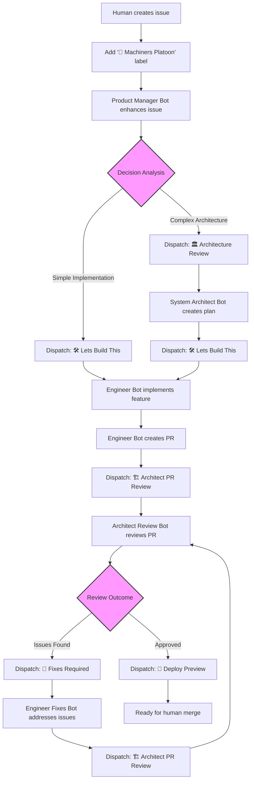

# Machiners Platoon Architecture

This document provides detailed information about the Machiners Platoon architecture, bot specifications, and workflow mechanics.

## 🤖 Agent Squadron Details

### 1. Product Manager Bot (`product-manager-bot.yml`)

**Trigger**: Issues labeled with `🤖 Machiners Platoon`

**Capabilities:**
- Analyzes and enhances issue descriptions (with automatic translation support)
- Adds detailed acceptance criteria and requirements
- Provides complexity estimates and dependency analysis
- Makes intelligent decisions about next steps (architect review vs direct implementation)
- Updates issue titles and bodies directly
- Automatically triggers appropriate downstream bots

**Decision Logic:**
- Creates `architect_decision.json` with routing decisions
- Evaluates feature complexity and architectural impact
- Routes simple implementations directly to Engineer Bot
- Routes complex features through System Architect Bot first

### 2. System Architect Bot (`system-architect-bot.yml`)

**Trigger**: Repository dispatch event `🏛️ Architecture Review`

**Capabilities:**
- Analyzes the project codebase architecture comprehensively
- Creates detailed technical implementation plans
- Specifies exact files and components to modify
- Follows existing patterns and architecture
- Provides integration guidance and risk assessment
- Automatically triggers Engineer Bot when ready for implementation

**Analysis Areas:**
- Existing code patterns and conventions
- Framework and library usage
- Security considerations
- Performance implications
- Integration requirements

### 3. Engineer Bot (`engineer-bot.yml`)

**Trigger**: Repository dispatch event `🛠️ Lets Build This`

**Capabilities:**
- Creates feature branches automatically (`feature/issue-{number}`)
- Implements features according to architectural plans
- Follows project coding conventions and patterns
- Runs comprehensive validation (lint, format, typecheck)
- Creates pull requests with detailed descriptions including issue links
- Updates original issues with PR links
- Automatically triggers Architect Review Bot

**Implementation Process:**
1. Creates dedicated feature branch
2. Implements code following existing patterns
3. Runs project-specific validation commands
4. Creates detailed PR with implementation summary
5. Links PR to original issue
6. Triggers automated review process

### 4. System Architect Bot - PR Review (`architect-review-bot.yml`)

**Trigger**: Repository dispatch event `🏗️ Architect PR Review`

**Capabilities:**
- Reviews implementation against architectural plans
- Checks code quality and pattern adherence
- Validates security and performance considerations
- Provides detailed feedback with specific line references
- Ensures integration with existing systems
- **Review Cycle Protection**: Maximum 3 review cycles to prevent infinite loops
- Automatically triggers Engineer Fixes Bot or Preview Deployment based on review outcome

**Review Criteria:**
- Architectural compliance
- Code quality standards
- Security best practices
- Performance considerations
- Integration compatibility
- Documentation completeness

### 5. Engineer Bot - PR Fixes (`engineer-fixes-bot.yml`)

**Trigger**: Repository dispatch event `🔧 Fixes Required` or `🤖engineer` mentions in PR comments

**Capabilities:**
- Addresses review feedback systematically
- Implements requested fixes and improvements
- Maintains code quality throughout fixes
- Runs comprehensive validation after fixes
- **Review Cycle Protection**: Respects maximum cycle limits
- Automatically triggers re-review by Architect Bot

**Fix Process:**
1. Analyzes review feedback
2. Implements requested changes
3. Maintains coding standards
4. Re-runs validation suite
5. Triggers automated re-review

## 🔄 Detailed Development Workflow

## 🔄 Automated Workflow Chain

The Machiners Platoon operates via sophisticated repository dispatch events:

1. **Issue Creation** → Human creates issue and adds `🤖 Machiners Platoon` label
2. **Product Manager Bot** → Enhances issue, analyzes complexity, makes intelligent routing decisions
    - Creates `architect_decision.json` with next action: `architect`, `direct_implementation`, or `none`
3. **Automatic Routing**:
    - **Complex features** → Dispatches `🏛️ Architecture Review` event
    - **Simple features** → Dispatches `🛠️ Lets Build This` event directly
4. **System Architect Bot** (if needed) → Creates technical plan, dispatches `🛠️ Lets Build This`
5. **Engineer Bot** → Implements feature, creates PR, dispatches `🏗️ Architect PR Review`
6. **Architect Review Bot** → Reviews PR, creates review cycle tracking
    - **If issues found** → Dispatches `🔧 Fixes Required`
    - **If approved** → Dispatches `🚀 Deploy Preview` and adds `🤖: Architect Approved` label
7. **Engineer Fixes Bot** (if needed) → Addresses feedback, dispatches `🏗️ Architect PR Review` for re-review
8. **Cycle Protection** → Maximum 3 review cycles to prevent infinite loops and control costs

## Repository Dispatch Events

### Core Events
- `🏛️ Architecture Review` → Triggers System Architect Bot
- `🛠️ Lets Build This` → Triggers Engineer Bot implementation
- `🏗️ Architect PR Review` → Triggers Architect Review Bot
- `🔧 Fixes Required` → Triggers Engineer Fixes Bot
- `🚀 Deploy Preview` → Triggers preview deployment

### Manual Override Triggers
- `🤖engineer` in PR comments → Manually trigger Engineer Fixes Bot
- Review cycle labels can be manually removed to reset automation

## Automated Labels

### Core Labels
- `🤖 Machiners Platoon` → Required label to trigger automation (never removed)
- `🤖: Review Cycle 1/2/3` → Tracks review iterations
- `🤖: Architect Approved` → PR approved and ready for merge

### Control Labels
- `🚨: Manual Review Required` → Maximum cycles reached, human intervention needed
- `🤖: Max Cycles Reached` → Automation stopped due to cycle limits

## 📋 Detailed Agent Capabilities

### What the Agents Can Do

- ✅ Analyze and enhance issue requirements (with translation support)
- ✅ Make intelligent routing decisions (architect vs direct implementation)
- ✅ Create detailed technical architecture plans
- ✅ Implement code following existing patterns and conventions
- ✅ Create and manage Git branches automatically
- ✅ Run comprehensive validation (lint, format, typecheck)
- ✅ Create and update pull requests with proper linking
- ✅ Provide detailed code reviews with cycle tracking
- ✅ Address review feedback systematically
- ✅ Trigger preview deployments automatically
- ✅ Control costs with cycle limits and smart routing
- ✅ Track execution costs and provide transparency

### What the Agents Cannot Do

- ❌ Approve or merge pull requests
- ❌ Access external systems beyond the repository
- ❌ Modify repository settings or permissions
- ❌ Access CI/CD secrets or production systems
- ❌ Exceed 3 review cycles without manual intervention
- ❌ Remove the `🤖 Machiners Platoon` label

## Cost Management Details

### Execution Tracking
- Each bot execution is tracked with cost information
- Duration and token usage monitoring
- Cost information automatically added to issues in standardized table format

### Cycle Protection
- Maximum 3 review iterations to control AI costs
- Automatic stopping when limits are reached
- Manual override capabilities for exceptional cases

### Smart Routing
- Product Manager Bot makes intelligent decisions to avoid unnecessary architect reviews
- Direct implementation for simple features
- Architectural planning only for complex requirements

## Security Architecture

### Repository Scope
- All bots operate with limited repository scope
- Specific tool allowlists for each bot type
- No access to external systems or services

### Permission Model
- Bots cannot approve PRs (security measure)
- Human oversight required for final merge
- Automatic commit signing for all bot commits
- API keys securely stored in GitHub secrets

### Cycle Protection
- Built-in limits prevent infinite loops
- Automatic detection of runaway processes
- Manual intervention points for oversight

## Integration Patterns

### Event-Driven Architecture
- Repository dispatch events for bot coordination
- JSON decision files for routing (never committed)
- Asynchronous workflow execution

### State Management
- Cycle tracking through labels
- Issue-PR linking with standardized sections
- Cost tracking and transparency

### Error Handling
- Graceful degradation when cycles exceed limits
- Manual override capabilities
- Clear status indicators for human intervention