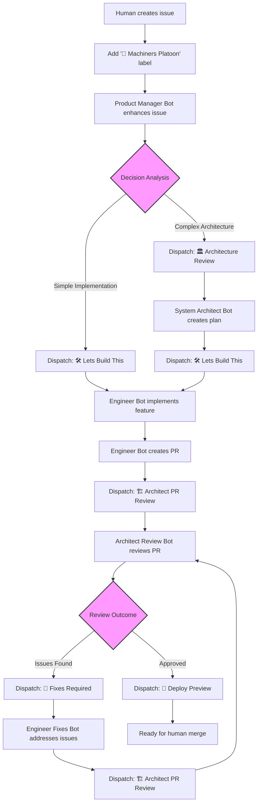

# 🤖 Machiners Platoon - GitHub Development Agent Squadron

This project contains the GitHub Actions workflows that implement the **Machiners Platoon**, an automated development agent squadron for your project.

## Getting Started for Humans

Try talking to your coding agent to integrate this workflow.

### Example: [Claude Code](https://docs.anthropic.com/en/docs/claude-code/overview)
```shell
claude "https://github.com/convcha/machiners-platoon Read the 'Getting Started for Coding Agents' section and integrate this GitHub Actions into the project"
```

For busy developers (skip permission prompts - use at your own risk):
```shell
claude --dangerously-skip-permissions "https://github.com/convcha/machiners-platoon Read the 'Getting Started for Coding Agents' section and integrate this GitHub Actions into the project"
```

## Getting Started for Coding Agents

When integrating Machiners Platoon into a project, follow these steps:

### 1. Integrate GitHub Actions

Copy the workflow files from this repository to the target project's `.github/workflows/` directory:
- `product-manager-bot.yml`
- `system-architect-bot.yml` 
- `engineer-bot.yml`
- `architect-review-bot.yml`
- `engineer-fixes-bot.yml`

Copy the custom action for cost tracking to `.github/actions/claude-result-tracker/`:
- `action.yml`

**Project Adaptation:** See the "⚠️ Important: Project Adaptation Required" section below for details on adapting workflows to the target project's technology stack.

### 1.1. Language Detection and Communication

**IMPORTANT:** Before displaying the setup template, analyze the target project's README.md content to determine the user's preferred language:

- Read the target project's README.md file
- Detect the primary language used (English, Japanese, Chinese, Spanish, etc.)
- Use the detected language for all subsequent communication with the user
- Translate the setup and usage template to match the detected language

**Language Detection Guidelines:**
- If README contains primarily Japanese text → Communicate in Japanese
- If README contains primarily Chinese text → Communicate in Chinese  
- If README contains primarily Spanish text → Communicate in Spanish
- If README is mixed or unclear → Default to English
- If README doesn't exist → Default to English

### 2. Setup and Usage Instructions

After integration, display the following setup and usage information to the user in the CLI terminal using this template:

**IMPORTANT:** Translate the entire template below to the language detected from the target project's README.md before displaying it to the user.

```markdown
## ✅ Integration Complete

Created GitHub Actions workflows:
- product-manager-bot.yml - Analyzes issues and routes them appropriately
- system-architect-bot.yml - Provides technical planning for complex features
- engineer-bot.yml - Implements features and creates pull requests
- architect-review-bot.yml - Reviews PRs for architectural compliance
- engineer-fixes-bot.yml - Addresses PR feedback and fixes issues

Created custom action:
- claude-result-tracker/action.yml - Tracks execution costs and metrics

## 🔧 [Technology]-Specific Adaptations

Technology stack updates:
- [List specific technology adaptations made]
- [Updated build commands and validation steps]
- [Framework-specific integrations]

Project-specific customizations:
- [Tailored instructions for the project domain]
- [Added framework integration patterns]
- [Included technology-specific best practices]
- [Configured proper guidelines for the stack]

## 🛠️ Required Setup

**GitHub Repository Settings:**
1. Navigate to **Settings → Actions → General** in your repository
2. Enable "Allow GitHub Actions to create and approve pull requests"

**GitHub Secrets Configuration:**
Add the following secrets in **Settings → Secrets and variables → Actions**:
- `ANTHROPIC_API_KEY` - Your Claude API key
- `GH_PERSONAL_ACCESS_TOKEN` - GitHub token with repo permissions

## 🚀 How to Use

1. **Create an issue** with any feature request or bug report
2. **Add the `🤖 Machiners Platoon` label** to trigger automation
3. **The system will automatically:**
   - Enhance the issue with detailed requirements
   - Create implementation plans if needed
   - Implement the feature and create a pull request
   - Review the implementation with feedback loops
   - Prepare the PR for human review and merge

The entire process is automated from issue creation to production-ready code, with built-in cost controls and cycle protection!
```

**Example for Japanese Projects:**
If the target project's README is primarily in Japanese, translate and display like this:

```markdown
## ✅ 統合完了

作成されたGitHub Actionsワークフロー:
- product-manager-bot.yml - 課題を分析し適切にルーティング
- system-architect-bot.yml - 複雑な機能の技術計画を提供
- engineer-bot.yml - 機能を実装しプルリクエストを作成
- architect-review-bot.yml - アーキテクチャの適合性をレビュー
- engineer-fixes-bot.yml - PRフィードバックと課題修正に対応

作成されたカスタムアクション:
- claude-result-tracker/action.yml - 実行コストとメトリクスを追跡

## 🔧 [技術名]固有の適応

技術スタックの更新:
- [実行された特定の技術適応をリスト]
- [ビルドコマンドと検証ステップの更新]
- [フレームワーク固有の統合]

プロジェクト固有のカスタマイズ:
- [プロジェクトドメインに合わせた指示]
- [フレームワーク統合パターンの追加]
- [技術固有のベストプラクティスを含む]
- [スタックに適したガイドラインの設定]

## 🛠️ 必要なセットアップ

**GitHubリポジトリ設定:**
1. リポジトリの**設定 → Actions → General**に移動
2. "GitHub Actionsにプルリクエストの作成と承認を許可する"を有効化

**GitHubシークレット設定:**
**設定 → Secrets and variables → Actions**で以下のシークレットを追加:
- `ANTHROPIC_API_KEY` - あなたのClaude APIキー
- `GH_PERSONAL_ACCESS_TOKEN` - リポジトリ権限を持つGitHubトークン

## 🚀 使用方法

1. **課題を作成** - 機能リクエストやバグレポートで課題を作成
2. **`🤖 Machiners Platoon`ラベルを追加** - 自動化をトリガー
3. **システムが自動的に実行:**
   - 詳細な要件で課題を強化
   - 必要に応じて実装計画を作成
   - 機能を実装しプルリクエストを作成
   - フィードバックループで実装をレビュー
   - 人間のレビューとマージ用にPRを準備

課題作成から本番対応コードまで、コスト制御とサイクル保護を内蔵した完全自動化プロセス！
```

## 🔧 Setup Requirements

### Required GitHub Repository Settings

**Allow GitHub Actions to create and approve pull requests**

Machiners Platoon requires GitHub Actions to have permission to create pull requests. This setting must be enabled in your repository:

1. Go to your repository **Settings** → **Actions** → **General**
2. Scroll down to **Workflow permissions**
3. Check the box **"Allow GitHub Actions to create and approve pull requests"**


📖 [GitHub Documentation](https://docs.github.com/en/repositories/managing-your-repositorys-settings-and-features/enabling-features-for-your-repository/managing-github-actions-settings-for-a-repository#preventing-github-actions-from-creating-or-approving-pull-requests)

### Required GitHub Secrets

- `ANTHROPIC_API_KEY` - Claude API key for all bots
- `GH_PERSONAL_ACCESS_TOKEN` - Personal access token for repository dispatch events

### Required Permissions

The Claude GitHub app needs:

- **Pull Requests**: Read and write
- **Issues**: Read and write
- **Contents**: Read and write
- **Actions**: Write (for repository dispatch events)
- **Metadata**: Read

## ⚠️ Important: Project Adaptation Required

**When using these workflows in your project, you MUST modify the project setup steps:**

The Engineer Bot (`engineer-bot.yml`) and Engineer Fixes Bot (`engineer-fixes-bot.yml`) workflows contain Node.js-specific setup steps that need to be adapted for your project:

```yaml
# NOTE FOR CODING AGENTS: Please modify the following steps (Setup Node.js to Install dependencies)
# according to your project's requirements.
# Examples:
# - For Python projects: use setup-python action
# - For Go projects: use setup-go action  
# - For Java projects: use setup-java action
# - For other languages: use appropriate setup actions
```

**Required Modifications:**
- Replace `Setup Node.js` step with appropriate language setup action
- Replace `Install pnpm` step with your package manager
- Replace `pnpm install` with your dependency installation command
- Update validation commands in bot instructions (`pnpm`, `npm`, `pip`, `go mod`, etc.)

**Examples for Different Languages:**
- **Python**: Use `setup-python` action, `pip install -r requirements.txt`
- **Go**: Use `setup-go` action, `go mod download`
- **Java**: Use `setup-java` action, `mvn install` or `gradle build`
- **Rust**: Use `dtolnay/rust-toolchain` action, `cargo build`

## 🤖 Agent Squadron

### 1. Product Manager Bot (`product-manager-bot.yml`)

**Trigger**: Issues labeled with `🤖 Machiners Platoon`

- Analyzes and enhances issue descriptions (with automatic translation support)
- Adds detailed acceptance criteria and requirements
- Provides complexity estimates and dependency analysis
- Makes intelligent decisions about next steps (architect review vs direct implementation)
- Updates issue titles and bodies directly
- Automatically triggers appropriate downstream bots

### 2. System Architect Bot (`system-architect-bot.yml`)

**Trigger**: Repository dispatch event `🏛️ Architecture Review`

- Analyzes the project codebase architecture comprehensively
- Creates detailed technical implementation plans
- Specifies exact files and components to modify
- Follows existing patterns and architecture
- Provides integration guidance and risk assessment
- Automatically triggers Engineer Bot when ready for implementation

### 3. Engineer Bot (`engineer-bot.yml`)

**Trigger**: Repository dispatch event `🛠️ Lets Build This`

- Creates feature branches automatically (`feature/issue-{number}`)
- Implements features according to architectural plans
- Follows project coding conventions and patterns
- Runs comprehensive validation (e.g. Full lint, format, and typecheck)
- Creates pull requests with detailed descriptions including issue links
- Updates original issues with PR links
- Automatically triggers Architect Review Bot

### 4. System Architect Bot - PR Review (`architect-review-bot.yml`)

**Trigger**: Repository dispatch event `🏗️ Architect PR Review`

- Reviews implementation against architectural plans
- Checks code quality and pattern adherence
- Validates security and performance considerations
- Provides detailed feedback with specific line references
- Ensures integration with existing systems
- **Review Cycle Protection**: Maximum 3 review cycles to prevent infinite loops
- Automatically triggers Engineer Fixes Bot or Preview Deployment based on review outcome

### 5. Engineer Bot - PR Fixes (`engineer-fixes-bot.yml`)

**Trigger**: Repository dispatch event `🔧 Fixes Required` or `🤖engineer` mentions in PR comments

- Addresses review feedback systematically
- Implements requested fixes and improvements
- Maintains code quality throughout fixes
- Runs comprehensive validation (e.g. Full lint, format, and typecheck) after fixes
- **Review Cycle Protection**: Respects maximum cycle limits
- Automatically triggers re-review by Architect Bot

## 🔄 Development Workflow



## 🎯 Usage

### For New Features

1. Create an issue with any content
2. Add the `🤖 Machiners Platoon` label to trigger the automation
3. The Product Manager Bot will automatically enhance the issue and trigger appropriate next steps
4. The full automation chain will run without further intervention

## 🔄 Automated Workflow Chain

The Machiners Platoon operates via sophisticated repository dispatch events:

1. **Issue Creation** → Human creates issue and adds `🤖 Machiners Platoon` label
2. **Product Manager Bot** → Enhances issue, analyzes complexity, makes intelligent routing decisions
    - Creates `architect_decision.json` with next action: `architect`, `direct_implementation`, or `none`
3. **Automatic Routing**:
    - **Complex features** → Dispatches `🏛️ Architecture Review` event
    - **Simple features** → Dispatches `🛠️ Lets Build This` event directly
4. **System Architect Bot** (if needed) → Creates technical plan, dispatches `🛠️ Lets Build This`
5. **Engineer Bot** → Implements feature, creates PR, dispatches `🏗️ Architect PR Review`
6. **Architect Review Bot** → Reviews PR, creates review cycle tracking
    - **If issues found** → Dispatches `🔧 Fixes Required`
    - **If approved** → Dispatches `🚀 Deploy Preview` and adds `🤖: Architect Approved` label
7. **Engineer Fixes Bot** (if needed) → Addresses feedback, dispatches `🏗️ Architect PR Review` for re-review
8. **Cycle Protection** → Maximum 3 review cycles to prevent infinite loops and control costs

### Repository Dispatch Events

- `🏛️ Architecture Review` → Triggers System Architect Bot
- `🛠️ Lets Build This` → Triggers Engineer Bot implementation
- `🏗️ Architect PR Review` → Triggers Architect Review Bot
- `🔧 Fixes Required` → Triggers Engineer Fixes Bot
- `🚀 Deploy Preview` → Triggers preview deployment

### Manual Override Triggers

- `🤖engineer` in PR comments → Manually trigger Engineer Fixes Bot
- Review cycle labels can be manually removed to reset automation

### Automated Labels

- `🤖 Machiners Platoon` → Required label to trigger automation (never removed)
- `🤖: Review Cycle 1/2/3` → Tracks review iterations
- `🤖: Architect Approved` → PR approved and ready for merge
- `🚨: Manual Review Required` → Maximum cycles reached, human intervention needed
- `🤖: Max Cycles Reached` → Automation stopped due to cycle limits


## 🛡️ Security Features

- All bots operate with limited repository scope
- Commits are automatically signed
- API keys are securely stored in GitHub secrets
- Bots cannot approve PRs (security measure)
- Human oversight required for final merge
- **Review Cycle Limits**: Maximum 3 automated review cycles to prevent infinite loops
- **Cost Control**: Automatic stopping of expensive AI operations when limits are reached
- **Manual Override**: Cycle limits can be reset manually when appropriate

## 🔄 Cost Management

- **Execution Tracking**: Each bot execution is tracked with cost information
- **Cycle Limits**: Maximum 3 review iterations to control AI costs
- **Smart Routing**: Product Manager Bot makes intelligent decisions to avoid unnecessary architect reviews
- **Automatic Stopping**: Bots stop automatically when cycle limits are reached

## 📋 Agent Capabilities

### What the Agents Can Do

- ✅ Analyze and enhance issue requirements (with translation support)
- ✅ Make intelligent routing decisions (architect vs direct implementation)
- ✅ Create detailed technical architecture plans
- ✅ Implement code following existing patterns and conventions
- ✅ Create and manage Git branches automatically
- ✅ Run comprehensive validation (e.g. Full lint, format, and typecheck)
- ✅ Create and update pull requests with proper linking
- ✅ Provide detailed code reviews with cycle tracking
- ✅ Address review feedback systematically
- ✅ Trigger preview deployments automatically
- ✅ Control costs with cycle limits and smart routing
- ✅ Track execution costs and provide transparency

### What the Agents Cannot Do

- ❌ Approve or merge pull requests
- ❌ Access external systems beyond the repository
- ❌ Modify repository settings or permissions
- ❌ Access CI/CD secrets or production systems
- ❌ Exceed 3 review cycles without manual intervention
- ❌ Remove the `🤖 Machiners Platoon` label

## 🎮 Agent Coordination

The agents are designed to work together seamlessly via repository dispatch events:

- **Product Manager Bot** analyzes complexity and routes appropriately
- **System Architect Bot** provides technical direction when needed
- **Engineer Bot** implements features and creates PRs
- **Architect Review Bot** validates implementation with cycle protection
- **Engineer Fixes Bot** addresses feedback within cycle limits
- **Automatic Triggers** create a seamless pipeline with cost controls
- **Human oversight** ensures quality and makes final decisions

This creates a complete, cost-controlled development pipeline from rough idea to production-ready code with built-in safeguards against infinite loops.

## 🚀 Advanced Features

1. **Intelligent Decision Making**: Product Manager Bot analyzes issue complexity
2. **Automatic Translation**: Issues in any language are translated to English
3. **Cycle Protection**: Maximum 3 review cycles with cost tracking
4. **Smart Routing**: Direct implementation for simple features
5. **Preview Deployment**: Automatic deployment of approved PRs
6. **Comprehensive Validation**: Full lint, format, and typecheck validation
7. **Issue-PR Linking**: Automatic bidirectional linking between issues and PRs
8. **Cost Transparency**: Execution cost tracking for all bot operations
