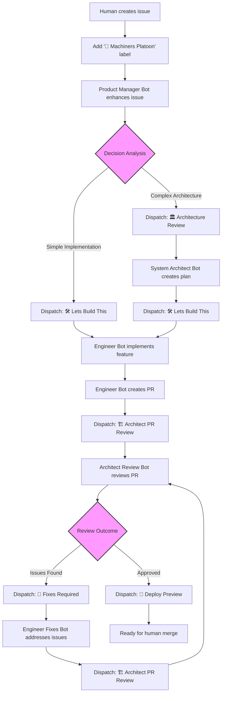

# Machiners Platoon - GitHub Development Agent Squadron

This project contains the GitHub Actions workflows that implement the **Machiners Platoon**, an automated development agent squadron for your project.

## 🤖 Agent Squadron

### 1. Product Manager Bot (`product-manager-bot.yml`)

**Trigger**: Issues labeled with `🤖 Machiners Platoon`

- Analyzes and enhances issue descriptions (with automatic translation support)
- Adds detailed acceptance criteria and requirements
- Provides complexity estimates and dependency analysis
- Makes intelligent decisions about next steps (architect review vs direct implementation)
- Updates issue titles and bodies directly
- Automatically triggers appropriate downstream bots

### 2. System Architect Bot (`system-architect-bot.yml`)

**Trigger**: Repository dispatch event `🏛️ Architecture Review`

- Analyzes the project codebase architecture comprehensively
- Creates detailed technical implementation plans
- Specifies exact files and components to modify
- Follows existing patterns and architecture
- Provides integration guidance and risk assessment
- Automatically triggers Engineer Bot when ready for implementation

### 3. Engineer Bot (`engineer-bot.yml`)

**Trigger**: Repository dispatch event `🛠️ Lets Build This`

- Creates feature branches automatically (`feature/issue-{number}`)
- Implements features according to architectural plans
- Follows project coding conventions and patterns
- Runs comprehensive validation (e.g. Full lint, format, and typecheck)
- Creates pull requests with detailed descriptions including issue links
- Updates original issues with PR links
- Automatically triggers Architect Review Bot

### 4. System Architect Bot - PR Review (`architect-review-bot.yml`)

**Trigger**: Repository dispatch event `🏗️ Architect PR Review`

- Reviews implementation against architectural plans
- Checks code quality and pattern adherence
- Validates security and performance considerations
- Provides detailed feedback with specific line references
- Ensures integration with existing systems
- **Review Cycle Protection**: Maximum 3 review cycles to prevent infinite loops
- Automatically triggers Engineer Fixes Bot or Preview Deployment based on review outcome

### 5. Engineer Bot - PR Fixes (`engineer-fixes-bot.yml`)

**Trigger**: Repository dispatch event `🔧 Fixes Required` or `🤖engineer` mentions in PR comments

- Addresses review feedback systematically
- Implements requested fixes and improvements
- Maintains code quality throughout fixes
- Runs comprehensive validation (e.g. Full lint, format, and typecheck) after fixes
- **Review Cycle Protection**: Respects maximum cycle limits
- Automatically triggers re-review by Architect Bot

## 🔄 Development Workflow

## 🎯 Usage

### For New Features

1. Create an issue with any content
2. Add the `🤖 Machiners Platoon` label to trigger the automation
3. The Product Manager Bot will automatically enhance the issue and trigger appropriate next steps
4. The full automation chain will run without further intervention

## 🔄 Automated Workflow Chain

The Machiners Platoon operates via sophisticated repository dispatch events:

1. **Issue Creation** → Human creates issue and adds `🤖 Machiners Platoon` label
2. **Product Manager Bot** → Enhances issue, analyzes complexity, makes intelligent routing decisions
    - Creates `architect_decision.json` with next action: `architect`, `direct_implementation`, or `none`
3. **Automatic Routing**:
    - **Complex features** → Dispatches `🏛️ Architecture Review` event
    - **Simple features** → Dispatches `🛠️ Lets Build This` event directly
4. **System Architect Bot** (if needed) → Creates technical plan, dispatches `🛠️ Lets Build This`
5. **Engineer Bot** → Implements feature, creates PR, dispatches `🏗️ Architect PR Review`
6. **Architect Review Bot** → Reviews PR, creates review cycle tracking
    - **If issues found** → Dispatches `🔧 Fixes Required`
    - **If approved** → Dispatches `🚀 Deploy Preview` and adds `🤖: Architect Approved` label
7. **Engineer Fixes Bot** (if needed) → Addresses feedback, dispatches `🏗️ Architect PR Review` for re-review
8. **Cycle Protection** → Maximum 3 review cycles to prevent infinite loops and control costs

### Repository Dispatch Events

- `🏛️ Architecture Review` → Triggers System Architect Bot
- `🛠️ Lets Build This` → Triggers Engineer Bot implementation
- `🏗️ Architect PR Review` → Triggers Architect Review Bot
- `🔧 Fixes Required` → Triggers Engineer Fixes Bot
- `🚀 Deploy Preview` → Triggers preview deployment

### Manual Override Triggers

- `🤖engineer` in PR comments → Manually trigger Engineer Fixes Bot
- Review cycle labels can be manually removed to reset automation

### Automated Labels

- `🤖 Machiners Platoon` → Required label to trigger automation (never removed)
- `🤖: Review Cycle 1/2/3` → Tracks review iterations
- `🤖: Architect Approved` → PR approved and ready for merge
- `🚨: Manual Review Required` → Maximum cycles reached, human intervention needed
- `🤖: Max Cycles Reached` → Automation stopped due to cycle limits

## 🔧 Setup Requirements

### Required GitHub Secrets

- `ANTHROPIC_API_KEY` - Claude API key for all bots
- `GITHUB_TOKEN` - Automatically provided by GitHub
- `GH_PERSONAL_ACCESS_TOKEN` - Personal access token for repository dispatch events

### Required Permissions

The Claude GitHub app needs:

- **Pull Requests**: Read and write
- **Issues**: Read and write
- **Contents**: Read and write
- **Actions**: Write (for repository dispatch events)
- **Metadata**: Read

## 🛡️ Security Features

- All bots operate with limited repository scope
- Commits are automatically signed
- API keys are securely stored in GitHub secrets
- Bots cannot approve PRs (security measure)
- Human oversight required for final merge
- **Review Cycle Limits**: Maximum 3 automated review cycles to prevent infinite loops
- **Cost Control**: Automatic stopping of expensive AI operations when limits are reached
- **Manual Override**: Cycle limits can be reset manually when appropriate

## 🔄 Cost Management

- **Execution Tracking**: Each bot execution is tracked with cost information
- **Cycle Limits**: Maximum 3 review iterations to control AI costs
- **Smart Routing**: Product Manager Bot makes intelligent decisions to avoid unnecessary architect reviews
- **Automatic Stopping**: Bots stop automatically when cycle limits are reached

## 📋 Agent Capabilities

### What the Agents Can Do

- ✅ Analyze and enhance issue requirements (with translation support)
- ✅ Make intelligent routing decisions (architect vs direct implementation)
- ✅ Create detailed technical architecture plans
- ✅ Implement code following existing patterns and conventions
- ✅ Create and manage Git branches automatically
- ✅ Run comprehensive validation (e.g. Full lint, format, and typecheck)
- ✅ Create and update pull requests with proper linking
- ✅ Provide detailed code reviews with cycle tracking
- ✅ Address review feedback systematically
- ✅ Trigger preview deployments automatically
- ✅ Control costs with cycle limits and smart routing
- ✅ Track execution costs and provide transparency

### What the Agents Cannot Do

- ❌ Approve or merge pull requests
- ❌ Access external systems beyond the repository
- ❌ Modify repository settings or permissions
- ❌ Access CI/CD secrets or production systems
- ❌ Exceed 3 review cycles without manual intervention
- ❌ Remove the `🤖 Machiners Platoon` label

## 🎮 Agent Coordination

The agents are designed to work together seamlessly via repository dispatch events:

- **Product Manager Bot** analyzes complexity and routes appropriately
- **System Architect Bot** provides technical direction when needed
- **Engineer Bot** implements features and creates PRs
- **Architect Review Bot** validates implementation with cycle protection
- **Engineer Fixes Bot** addresses feedback within cycle limits
- **Automatic Triggers** create a seamless pipeline with cost controls
- **Human oversight** ensures quality and makes final decisions

This creates a complete, cost-controlled development pipeline from rough idea to production-ready code with built-in safeguards against infinite loops.

## 🚀 Advanced Features

1. **Intelligent Decision Making**: Product Manager Bot analyzes issue complexity
2. **Automatic Translation**: Issues in any language are translated to English
3. **Cycle Protection**: Maximum 3 review cycles with cost tracking
4. **Smart Routing**: Direct implementation for simple features
5. **Preview Deployment**: Automatic deployment of approved PRs
6. **Comprehensive Validation**: Full lint, format, and typecheck validation
7. **Issue-PR Linking**: Automatic bidirectional linking between issues and PRs
8. **Cost Transparency**: Execution cost tracking for all bot operations
