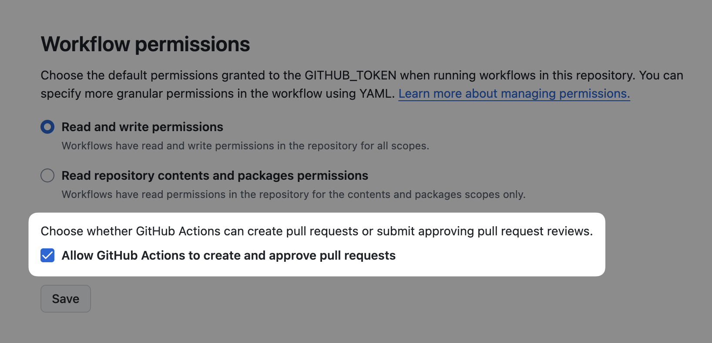
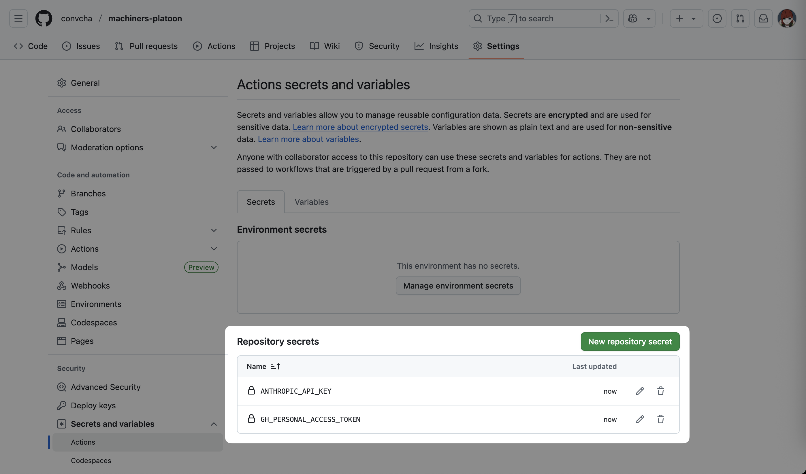
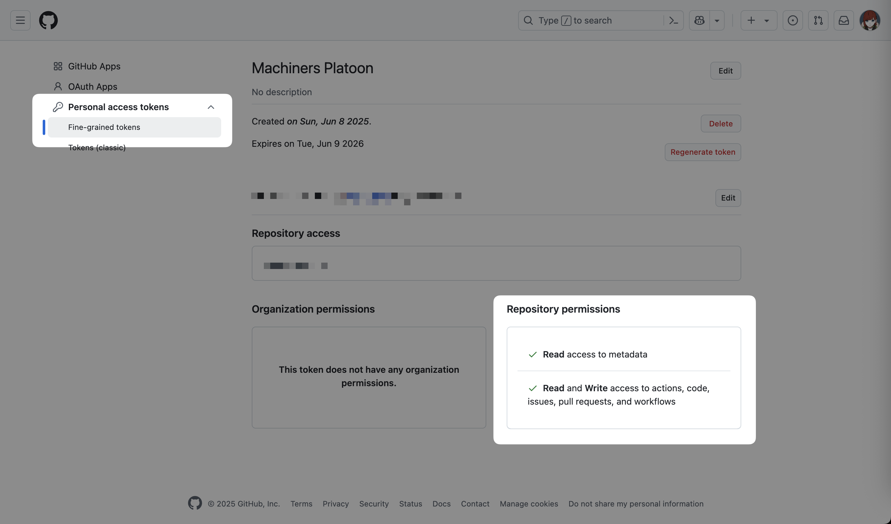
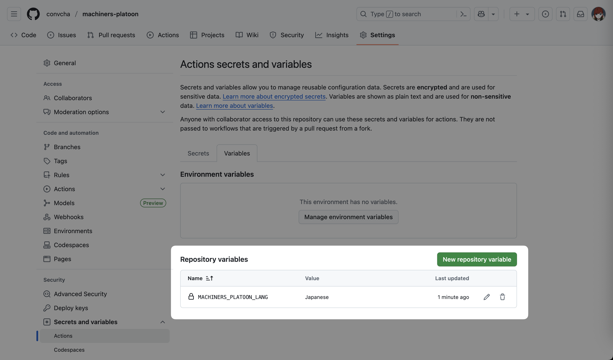
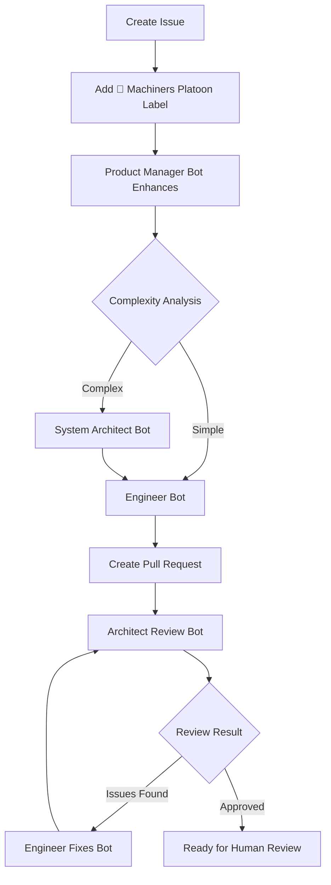

# 🤖 Machiners Platoon

An automated development agent squadron powered by GitHub Actions that transforms issues into production-ready pull requests.

## Overview

Machiners Platoon is a collection of 5 specialized AI bots that work together to automatically implement features, from initial issue analysis to final code review. Simply create an issue, add a label, and watch as the system enhances requirements, creates implementation plans, writes code, and prepares pull requests for review.

## Features

- **Automated Development Workflow**: Complete automation from issue to PR
- **Intelligent Routing**: Automatically determines if features need architectural planning
- **Multi-Agent Collaboration**: 5 specialized bots handle different aspects of development
- **Multi-Language Support**: Bots communicate in any language you prefer
- **Cost Control**: Built-in cycle limits prevent runaway AI costs
- **Language Agnostic**: Easily adaptable to any programming language or framework
- **Security First**: Human oversight required for final approval and merge

## Quick Start

### Automated Integration

Run in your repository's root directory with [Claude Code](https://docs.anthropic.com/en/docs/claude-code/overview) or other coding agents:

```bash
claude "https://github.com/convcha/machiners-platoon Read this URL's README carefully and copy these GitHub Actions into my project. ONLY modify the language setup sections marked with MODIFY THIS SECTION comments."
```

For busy developers (skip permission prompts - use at your own risk):
```bash
claude --dangerously-skip-permissions "https://github.com/convcha/machiners-platoon Read this URL's README carefully and copy these GitHub Actions into my project. ONLY modify the language setup sections marked with MODIFY THIS SECTION comments."
```

### Manual Integration

1. **Copy workflow files** to your repository's `.github/workflows/`:
   - `product-manager-bot.yml`
   - `system-architect-bot.yml`
   - `engineer-bot.yml`
   - `architect-review-bot.yml`
   - `engineer-fixes-bot.yml`

2. **Copy the custom action** to `.github/actions/claude-result-tracker/`:
   - `action.yml`

3. **Configure GitHub repository settings**:
   - Enable "Allow GitHub Actions to create and approve pull requests"
   - Path: Settings → Actions → General → Workflow permissions

4. **Add required secrets** (see [Configuration](#configuration) for details):
   - `ANTHROPIC_API_KEY` - Your Claude API key
   - `GH_PERSONAL_ACCESS_TOKEN` - GitHub token with repo permissions

## Configuration

### Repository Settings

Enable PR creation in **Settings → Actions → General**:
- ✅ Allow GitHub Actions to create and approve pull requests



### Required Secrets

Add in **Settings → Secrets and variables → Actions**:



- `ANTHROPIC_API_KEY` - Claude API key for AI operations
- `GH_PERSONAL_ACCESS_TOKEN` - [GitHub personal access tokens](https://docs.github.com/en/authentication/keeping-your-account-and-data-secure/managing-your-personal-access-tokens) for repository operations
  - The GitHub token needs:
    - Actions: Write
    - Contents: Write
    - Issues: Write
    - Metadata: Read
    - Pull requests: Write
  

### Language Settings (optional)

Add in **Settings → Secrets and variables → Actions → Variables**:
- `MACHINERS_PLATOON_LANG` - Target language for bot communications (optional, defaults to "English")
- Supports any natural language name (e.g., "日本語", "Español", "Français")



## ⚠️ Important: Language Setup Requirements

**🚨🚨🚨 CRITICAL WARNING FOR AI CODING AGENTS 🚨🚨🚨**

**YOU MUST NOT CHANGE, EDIT, OR ALTER THESE WORKFLOWS BEYOND THE EXPLICITLY MARKED SECTIONS BELOW.**

**⛔ FORBIDDEN MODIFICATIONS - NEVER CHANGE THESE:**
- `allowed_tools` lists in ANY workflow file
- `custom_instructions` content in ANY workflow file  
- `direct_prompt` content in ANY workflow file
- Repository dispatch event names or triggers
- Bot logic, conditions, or decision-making code
- Label management (`🤖 Machiners Platoon`, etc.)
- API configurations and security settings
- Cost tracking and cycle protection mechanisms
- Language settings (`MACHINERS_PLATOON_LANG` references)
- Any sections not explicitly marked with `<!-- MODIFY THIS SECTION -->`

**✅ ONLY MODIFY THESE EXPLICITLY MARKED SECTIONS:**

The Engineer Bot (`engineer-bot.yml`) and Engineer Fixes Bot (`engineer-fixes-bot.yml`) workflows contain Node.js-specific setup steps that MUST be replaced with your project's language. These steps are wrapped in clear modification markers:

```yaml
# <!-- MODIFY THIS SECTION START -->
# NOTE FOR CODING AGENTS: Please modify ONLY the following steps (Setup Node.js to Install dependencies)
# according to your project's requirements.
# Examples:
# - For Python projects: use setup-python action
# - For Go projects: use setup-go action  
# - For Java projects: use setup-java action
# - For other languages: use appropriate setup actions
# <!-- MODIFY THIS SECTION END -->
```

**Required Modifications (ONLY between the markers above):**
- Replace `Setup Node.js` step with appropriate language setup action
- Replace `Install pnpm` step with your package manager  
- Replace `pnpm install` with your dependency installation command
- Update validation commands in bot instructions (`pnpm`, `npm`, `pip`, `go mod`, etc.)

**🔒 PRESERVE THESE CRITICAL SETTINGS:**
- Keep `MACHINERS_PLATOON_LANG` environment variable references intact
- Maintain all `allowed_tools` lists exactly as provided
- Preserve all `custom_instructions` and `direct_prompt` content
- Keep all repository dispatch event configurations unchanged
- Maintain all label management logic unchanged

**Examples for Different Languages:**
- **Python**: Use `setup-python` action, `pip install -r requirements.txt`
- **Go**: Use `setup-go` action, `go mod download`
- **Java**: Use `setup-java` action, `mvn install` or `gradle build`  
- **Rust**: Use `dtolnay/rust-toolchain` action, `cargo build`

**🤖 AI CODING AGENTS: READ THIS TWICE**
If you modify ANY part of these workflows other than the sections explicitly marked with `<!-- MODIFY THIS SECTION -->` comments, you will break the entire automation system. The workflows are designed to work across all programming languages without modification to the AI logic.

## Usage

1. **Create an issue** with your feature request or bug report
2. **Add the `🤖 Machiners Platoon` label** to trigger automation
3. **Watch the magic happen**:
   - Issue gets enhanced with detailed requirements
   - Implementation plan is created (if needed)
   - Code is implemented and PR is created
   - Automated review and feedback cycles run
   - PR is prepared for human review and merge

## Bot Squadron

### Product Manager Bot
Analyzes and enhances issues, provides complexity estimates, and intelligently routes to appropriate downstream bots.

### System Architect Bot
Creates detailed technical implementation plans for complex features, analyzing existing codebase patterns.

### Engineer Bot
Implements features according to plans, creates feature branches, runs validation, and creates pull requests.

### Architect Review Bot
Reviews implementations for quality, security, and architectural compliance with automatic feedback cycles.

### Engineer Fixes Bot
Addresses review feedback systematically and maintains code quality throughout iterations.

## Workflow



## Cost Management

- **Cycle Limits**: Maximum 3 review iterations to control costs
- **Smart Routing**: Intelligent decisions to avoid unnecessary operations
- **Execution Tracking**: Detailed cost and duration tracking for all operations
- **Automatic Stopping**: Prevents infinite loops and runaway costs

## Security

- Bots cannot approve or merge PRs - human oversight required
- Limited repository scope with specific tool allowances
- Automatic commit signing
- Secure API key storage in GitHub secrets
- Built-in cycle protection prevents abuse

## Labels

- `🤖 Machiners Platoon` - Main trigger label (never removed automatically)
- `🤖 Review Cycle 1/2/3` - Tracks review iterations
- `🤖 Architect Approved` - PR ready for human review
- `🚨 Manual Review Required` - Human intervention needed
- `🤖 Max Cycles Reached` - Automation stopped due to limits

## Documentation

For detailed information about the system architecture, bot specifications, and workflow mechanics, see:

- [**ARCHITECTURE.md**](./ARCHITECTURE.md) - Detailed bot specifications, workflow diagrams, and system architecture

## Contributing

This project provides the foundation for automated development workflows. To contribute:

1. Fork the repository
2. Create your feature branch
3. Test your changes with the provided workflows
4. Submit a pull request

## License

This project is open source and available under the MIT License.
