# 🤖 Machiners Platoon

An automated development agent squadron powered by GitHub Actions that transforms issues into production-ready pull requests.

## Overview

Machiners Platoon is a collection of 5 specialized AI bots that work together to automatically implement features, from initial issue analysis to final code review. Simply create an issue, add a label, and watch as the system enhances requirements, creates implementation plans, writes code, and prepares pull requests for review.

## Features

- **Automated Development Workflow**: Complete automation from issue to PR
- **Intelligent Routing**: Automatically determines if features need architectural planning
- **Multi-Agent Collaboration**: 5 specialized bots handle different aspects of development
- **Multi-Language Support**: Bots communicate in any language you prefer
- **Cost Control**: Built-in cycle limits prevent runaway AI costs
- **Language Agnostic**: Easily adaptable to any programming language or framework
- **Security First**: Human oversight required for final approval and merge

## Getting Started

### Automated Installation

Run in your repository's root directory with [Claude Code](https://docs.anthropic.com/en/docs/claude-code/overview) or other coding agents:

```bash
claude "https://github.com/convcha/machiners-platoon Read this URL's README and install these GitHub Actions into my project."
```

For busy developers (skip permission prompts - use at your own risk):
```bash
claude --dangerously-skip-permissions "https://github.com/convcha/machiners-platoon Read this URL's README and install these GitHub Actions into my project."
```

### Manual Installation

1. **Copy workflow files** to your repository's `.github/workflows/`:
   - `.github/workflows/product-manager-bot.yml`
   - `.github/workflows/system-architect-bot.yml`
   - `.github/workflows/engineer-bot.yml`
   - `.github/workflows/architect-review-bot.yml`
   - `.github/workflows/engineer-fixes-bot.yml`

2. **Copy custom action directories** to your repository's `.github/actions/`:
   - `.github/actions/claude-result-tracker/`

3. **Insert language-specific setup steps** to `# <!-- INSERT SETUP STEPS HERE -->` in these files
    - engineer-bot.yml
    - engineer-fixes-bot.yml
    - NEVER: Do not edit other sections
    - NEVER: Do not edit other files

4. **Configure GitHub repository settings**:
   - Enable "Allow GitHub Actions to create and approve pull requests"
   - Path: Settings → Actions → General → Workflow permissions

5. **Add required secrets** (see [Configuration](#configuration) for details):
   - `ANTHROPIC_API_KEY` - Your Claude API key
   - `GH_PERSONAL_ACCESS_TOKEN` - GitHub token with repo permissions

## Configuration

### Repository Settings

Enable PR creation in **Settings → Actions → General**:
- ✅ Allow GitHub Actions to create and approve pull requests


### Required Secrets

Add in **Settings → Secrets and variables → Actions**:


- `ANTHROPIC_API_KEY` - Claude API key for AI operations
- `GH_PERSONAL_ACCESS_TOKEN` - [GitHub personal access tokens](https://docs.github.com/en/authentication/keeping-your-account-and-data-secure/managing-your-personal-access-tokens) for repository operations
  - The GitHub token needs:
    - Actions: Write
    - Contents: Write
    - Issues: Write
    - Metadata: Read
    - Pull requests: Write
  

### Language Settings (optional)

Add in **Settings → Secrets and variables → Actions → Variables**:
- `MACHINERS_PLATOON_LANG` - Target language for bot communications (optional, defaults to "English")
- Supports any natural language name (e.g., "日本語", "Español", "Français")


## Usage

1. **Create an issue** with your feature request or bug report
2. **Add the `🤖 Machiners Platoon` label** to trigger automation
3. **Watch the magic happen**:
   - Issue gets enhanced with detailed requirements
   - Implementation plan is created (if needed)
   - Code is implemented and PR is created
   - Automated review and feedback cycles run
   - PR is prepared for human review and merge

## Bot Squadron

### Product Manager Bot
Analyzes and enhances issues, provides complexity estimates, and intelligently routes to appropriate downstream bots.

### System Architect Bot
Creates detailed technical implementation plans for complex features, analyzing existing codebase patterns.

### Engineer Bot
Implements features according to plans, creates feature branches, runs validation, and creates pull requests.

### Architect Review Bot
Reviews implementations for quality, security, and architectural compliance with automatic feedback cycles.

### Engineer Fixes Bot
Addresses review feedback systematically and maintains code quality throughout iterations.

## Workflow

```mermaid
graph TD
    A[Create Issue] --> B[Add 🤖 Machiners Platoon Label]
    B --> C[Product Manager Bot Enhances]
    C --> D{Complexity Analysis}
    D -->|Complex| E[System Architect Bot]
    D -->|Simple| F[Engineer Bot]
    E --> F
    F --> G[Create Pull Request]
    G --> H[Architect Review Bot]
    H --> I{Review Result}
    I -->|Issues Found| J[Engineer Fixes Bot]
    I -->|Approved| K[Ready for Human Review]
    J --> H
```



## Cost Management

- **Cycle Limits**: Maximum 3 review iterations to control costs
- **Smart Routing**: Intelligent decisions to avoid unnecessary operations
- **Execution Tracking**: Detailed cost and duration tracking for all operations
- **Automatic Stopping**: Prevents infinite loops and runaway costs

## Security

- Bots cannot approve or merge PRs - human oversight required
- Limited repository scope with specific tool allowances
- Automatic commit signing
- Secure API key storage in GitHub secrets
- Built-in cycle protection prevents abuse

## Labels

- `🤖 Machiners Platoon` - Main trigger label (never removed automatically)
- `🤖 Review Cycle 1/2/3` - Tracks review iterations
- `🤖 Architect Approved` - PR ready for human review
- `🚨 Manual Review Required` - Human intervention needed
- `🤖 Max Cycles Reached` - Automation stopped due to limits

## Documentation

For detailed information about the system architecture, bot specifications, and workflow mechanics, see:

- [**ARCHITECTURE.md**](./ARCHITECTURE.md) - Detailed bot specifications, workflow diagrams, and system architecture

## Contributing

This project provides the foundation for automated development workflows. To contribute:

1. Fork the repository
2. Create your feature branch
3. Test your changes with the provided workflows
4. Submit a pull request

## License

This project is open source and available under the MIT License.
